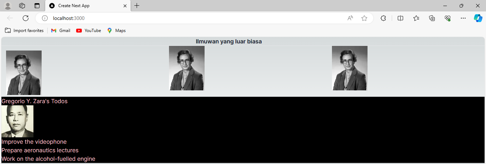

Nama    : Jenio Dwi Setyo Favian Gian

NIM     : 2141720212

# Praktikum: Belajar komponen
## Output Soal 1
 
Mengubah code pada file 'page.tsx'
## Output Soal 2
 
Dengan menambahkan kode pada file page.tsx yang berfungsi untuk memanggil komponen Gallery
## Output Soal 3
 
Memastikan bahwa semua elemen JSX berada dalam satu elemen induk, dalam hal ini 'div', mengganti penggunaan class dengan className, mengganti br menjadi br /, penutup tag yang benar dalam JSX, dan merapikan penggunaan tag b dan i.

## Soal 4
Terjadi error di kode bagian
```tsx
<h1>{person}'s Todos</h1>
```
karena penggunaan objek dan properti nya tidak lengkap.

Kode yang benar:
```tsx
<h1>{person.name}'s Todos</h1>
```
## Output Soal 5
 
Dalam kode yang telah diperbaiki, URL gambar sekarang dibuat secara dinamis menggunakan properti imageId dan imageSize dari objek person. Kemudian, URL ini digunakan dalam elemen 'img'. Sekarang, kode tersebut telah benar dan akan menghasilkan URL gambar yang sesuai dengan data yang ada dalam objek person.