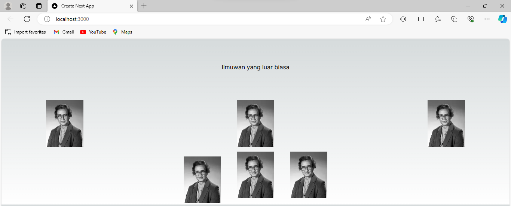
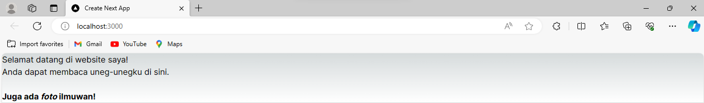

Nama    : Jenio Dwi Setyo Favian Gian

NIM     : 2141720212

# Praktikum: Belajar komponen
## Output Soal 1
 
Mengubah code pada file 'page.tsx'
## Output Soal 2
 
Dengan menambahkan kode pada file page.tsx yang berfungsi untuk memanggil komponen Gallery
## Output Soal 3
 
Memastikan bahwa semua elemen JSX berada dalam satu elemen induk, dalam hal ini 'div', mengganti penggunaan class dengan className, mengganti br menjadi br /, penutup tag yang benar dalam JSX, dan merapikan penggunaan tag b dan i.