Nama    : Jenio Dwi Setyo Favian Gian

NIM     : 2141720212


# Praktikum 1: Event Handler
## Langkah 1
Kita mencoba membuat tombol sederhana yang belum bisa melakukan apa-apa alias belum kita buat event handler untuk tombol tersebut. Sebagai contoh, berikut adalah sebuah tombol yang belum melakukan apa pun. Kita buat folder/file baru di `src/component/button.tsx`
```
export default function Tombol_1() {
    return (
        <button className="bg-blue-500 hover:bg-blue-700 text-white p-2 rounded">
            Ini tombol
        </button>
    )
}
```
Selanjutnya pada file `src/app/page.tsx` kita ubah menjadi seperti berikut
```
import Tombol_1 from "../components/button";

export default function Home() {
  return (
    <>
    <div className="container mx-auto">
      <h2>Kuis Kota</h2>
      <Tombol_1/>
    </div>
    </>
  )
}  
```
Kemudian kita jalankan perintah "npm run dev" dan kita buka alamat localhost:3000 pada browser. Maka akan tampil hasil seperti berikut
### Output Praktikum 1 Langkah 1
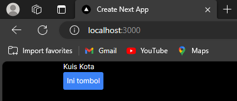 

## Langkah 2
Langkah 2
Kita bisa menambahkan event pada tombol tersebut. Seperti contoh kita buat ketika tombol di klik, akan memunculkan notif/alert. Kita dapat membuat pesan ketika pengguna mengeklik dengan mengikuti tiga langkah berikut:

1. Deklarasikan sebuah fungsi bernama `handleClick` di dalam komponen Button kita.
2. Implementasikan logika di dalam fungsi tersebut (gunakan `alert` untuk menampilkan pesan).
3. Tambahkan handler `onClick={handleClick}` ke tag JSX `< button >`

Perhatikan kode `button.tsx` berikut

```
export default function Tombol_1() {
    
    function handleClick(){
        alert("Tombol telah ditekan!!!");
    }
    function handleMouseOver(){
        alert("Eits, mau mencet tombol ya?");
    }

    return (
      <button 
      className=
      "bg-blue-500 hover:bg-blue-700 text-white p-2 rounded"
      onClick={handleClick}
      onMouseOver={handleMouseOver}
      >
        ini tombol
      </button>  

    );
}
```
Maka kita butuh mengatur agar komponen yang kita gunakan menjadi komponen client. Untuk menjadikan komponen client, kita cukup memberikan perintah ini `"use client"`; pada baris pertama file `page.tsx`
```
"use client";
import Tombol_1 from "../components/button";

export default function Home() {
```
### Output Praktikum 1 Langkah 2.1
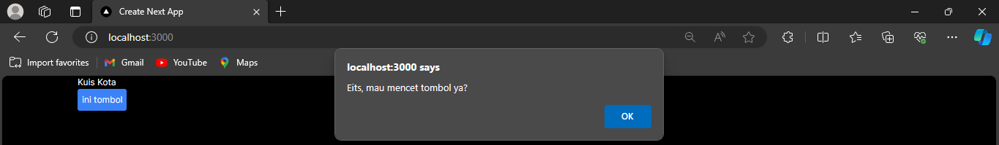 

Kita mendefinisikan fungsi `handleClick `dan kemudian mengopernya sebagai prop ke `< button >`. Method `handleClick`adalah sebuah event handler pada tombol tersebut.

Nama Method event handler sebaiknya memiliki format tertentu, seperti contoh memiliki nama yang diawali dengan kata handle, diikuti oleh nama event yang akan dilakukan. Contoh

- event handler untuk menangani ketika ada event klik tombol `onClick={handleClick}`,
- event handler untuk menangani ketika ada event `onMouseEnter={handleMouseEnter}`, dan lain sebagainya.
Selain itu, sebagai alternatif, Kita juga dapat mendefinisikan event handler secara inline dalam JSX secara langsung seperti berikut
```
return (
      <button 
      className=
      "bg-blue-500 hover:bg-blue-700 text-white p-2 rounded"
      onClick={handleClick}
    //   onMouseOver={handleMouseOver}
    onMouseLeave={() =>{
        alert("Loh, kok sudah pergi!!!")
    }}
      >
        ini tombol
      </button>  

    );
```
### Output Praktikum 1 Langkah 2.2
 

# Praktikum 2
Kita buat fungsi baru pada component `button.tsx`
```
export function Tombol_2({ isiPesan, namaTombol }) {
    return (
        <button
            className="bg-blue-500 hover:bg-blue-700 ☐ text-white p-2 rounded"
            onClick={() => alert(isiPesan)}>
            {namaTombol}
        </button>

    );
}
```
Pada component, hanya ada 1 fungsi yang memiliki `default` !

Parameter `isiPesan` dan `namaTombol` bisa diisi oleh layout yang ada di `page.tsx` nanti, sehingga komponen `Tombol_2` bernilai dinamis.

Sekarang kita modifikasi file `page.tsx` seperti berikut
```
"use client";
import Tombol_1, { Tombol_2 } from "../components/button";
export default function Home() {
  return (
    <>
      <div className="container mx-auto">
        <h2>Kuis Kota</h2>
        <Tombol_1 />
        <hr></hr>
        <Tombol_2 isiPesan="Ini Pesanku" namaTombol="Pesan" />
      </div>
    </>
  );
}
```
### Output Praktikum 2
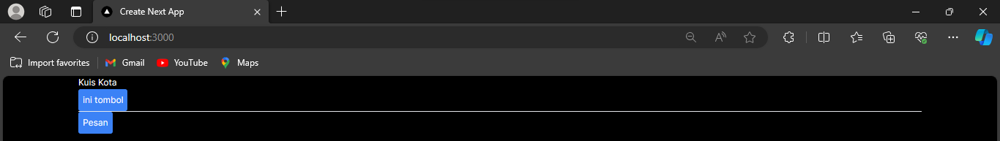 

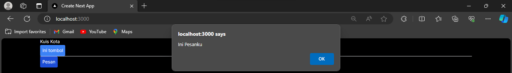 

Coba cek di browser dan amati apa yang terjadi?

Jelaskan mengapa bisa seperti itu?

# Praktikum 3
## Langkah 1 - Propagation
Sebagai contoh coba kita modifikasi file button.tsx seperti berikut
```
export function Tombol_2({ isiPesan, namaTombol}) {
    return (
        <button
            className="bg-blue-500 hover:bg-blue-700 text-white p-2 rounded"
            onClick={() => alert(isiPesan)}>
            {namaTombol}
        </button>
    );
}
export function Tombol_3({isiPesan, namaTombol}){
    return (
        <button
            className="bg-green-400 hover:bg-green-700 text-white p-2 rounded m-2"
            onClick={() => {
                alert(isiPesan)
            }
            }>
            {namaTombol}
        </button>

    );
}

export default function Tombol_1() {
```
Kemudian kita modifikasi fiile `page.tsx`
```
"use client";
import Tombol_1, { Tombol_2, Tombol_3 } from "@/components/button";
export default function Home() {
  return (
    <>
      <div className="container mx-auto">
        <h2>Kuis Kota</h2>
        <Tombol_1 />
        <hr></hr>
        <Tombol_2 isiPesan="Ini Pesanku" namaTombol="Pesan" />
      </div>
      <br></br>
      <div className="bg-red-300" onClick={() => alert('Parent Element: Div')}>
        <Tombol_3 isiPesan="Child Element: Tombol-1" namaTombol="Tombol-1" />
        <Tombol_3 isiPesan="Child Element: Tombol-2" namaTombol="Tombol-2" />
      </div>
    </>
  );
}
```
Kemudian kita jalankan di browser, coba klik `Tombol-1`, dan amati apa yang terjadi...!!!

Kita akan disuguhkan dengan pesan/alert sebanyak 2 kali, yaitu Pesan `"Child Element : Tombol-1"` dan pesan `"Parent Element : Div"`.
### Output Praktikum 3 Langkah 1
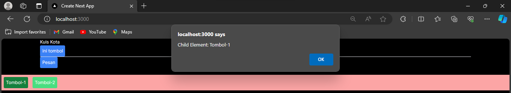 

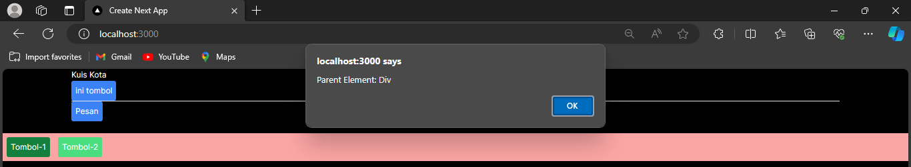 

Hal ini terjadi karena baik untuk element `div` maupun `button` memiliki event yang sama yaitu onClick, sehingga ketika button diklik maka event handler untuk onClick pada button akan dijalankan. Kemudian baru event handler dari parent (element div) akan dijalankan.

Hal ini disebut dengan propagation, dan biasa terjadi pada elemen child dan parent yang memiliki event yang sama.

## Langkah 2 - Stop Propagation
```
export function Tombol_3({isiPesan, namaTombol}) {
    return (
        <button
            className="bg-green-400 hover:bg-green-700 text-white p-2 rounded m-2"
            onClick={(e) => {
                e.stopPropagation();
                alert(isiPesan)
            }
            }>
            {namaTombol}
        </button>
    );
}
```
### Output Praktikum 3 Langkah 2
 

# Praktikum 4
## Langkah 1
Kita buat file data dummy untuk mencoba state pada `src/data/article.js` yang berisi seperti berikut
```
export const sculptureList = [{
    name: 'Homenaje a la Neurocirugía',
    artist: 'Marta Colvin Andrade',
    description: 'Although Colvin is predominantly known for abstract themes that allude to pre-Hispanic symbols, this gigantic sculpture, an homage to neurosurgery, is one of her most recognizable public art pieces.',
    url: 'https://i.imgur.com/Mx7dA2Y.jpg',
    alt: 'A bronze statue of two crossed hands delicately holding a human brain in their fingertips.'  
  }, {
    name: 'Floralis Genérica',
    artist: 'Eduardo Catalano',
    description: 'This enormous (75 ft. or 23m) silver flower is located in Buenos Aires. It is designed to move, closing its petals in the evening or when strong winds blow and opening them in the morning.',
    url: 'https://i.imgur.com/ZF6s192m.jpg',
    alt: 'A gigantic metallic flower sculpture with reflective mirror-like petals and strong stamens.'
  }, {
    name: 'Eternal Presence',
    artist: 'John Woodrow Wilson',
    description: 'Wilson was known for his preoccupation with equality, social justice, as well as the essential and spiritual qualities of humankind. This massive (7ft. or 2,13m) bronze represents what he described as "a symbolic Black presence infused with a sense of universal humanity."',
    url: 'https://i.imgur.com/aTtVpES.jpg',
    alt: 'The sculpture depicting a human head seems ever-present and solemn. It radiates calm and serenity.'
  }, {
    name: 'Moai',
    artist: 'Unknown Artist',
    description: 'Located on the Easter Island, there are 1,000 moai, or extant monumental statues, created by the early Rapa Nui people, which some believe represented deified ancestors.',
    url: 'https://i.imgur.com/RCwLEoQm.jpg',
    alt: 'Three monumental stone busts with the heads that are disproportionately large with somber faces.'
  }, {
    name: 'Blue Nana',
    artist: 'Niki de Saint Phalle',
    description: 'The Nanas are triumphant creatures, symbols of femininity and maternity. Initially, Saint Phalle used fabric and found objects for the Nanas, and later on introduced polyester to achieve a more vibrant effect.',
    url: 'https://i.imgur.com/Sd1AgUOm.jpg',
    alt: 'A large mosaic sculpture of a whimsical dancing female figure in a colorful costume emanating joy.'
  }];
```
Kemudian kita coba buat komponen baru di `src/component/gallery.tsx`
```
import { sculptureList } from '../data/article'; // ambil data yang sudah ada

export default function Gallery() {
    let index = 0; // index data mulai dari 0

    function handleClick() {
        index = index + 1; // counter index + 1, utk melihat data selanjutnya
    }
    let sculpture = sculptureList[index]; // membaca data sesuai dengan index
    return (
        <>
            <button
                onClick={handleClick}
                className="bg-blue-500 hover:bg-blue-700 p-2 m-2 rounded"> Artikel Selanjutnya </button>

            <h2><i>{sculpture.name} </i> oleh {sculpture.artist} </h2>
            <h3>({index + 1} dari {sculptureList.length}) </h3>
            
            <p>
                {sculpture.description}
            </p>
        </>
    );
}
```
Kita panggil komponen tersebut pada page.tsx
```
"use client";
import Tombol_1, { Tombol_2, Tombol_3 } from "../components/button"; 
import Gallery from "../components/gallery";

export default function Home() {
  return (
  <>
    <div className="container mx-auto">
      <h2>Kuis Kota</h2>
      <Tombol_1 />
      <hr></hr>
      <Tombol_2 isiPesan="Ini Pesanku" namaTombol="Pesan" />
    </div>
    <br></br>
    <div className="bg-red-300" onClick={() => alert('Parent Element: Div')}>
      <Tombol_3 isiPesan="Child Element: Tombol-1" namaTombol="Tombol-1" />
      <Tombol_3 isiPesan="Child Element: Tombol-2" namaTombol="Tombol-2" />
    </div>
    <br></br>
    <Gallery />
  </>
);
}
```
Sekarang coba di browser dan klik tombol "Artikel Selanjutnya" dan perhatikan apa yang terjadi...!!!
### Output Praktikum 4 Langkah 1
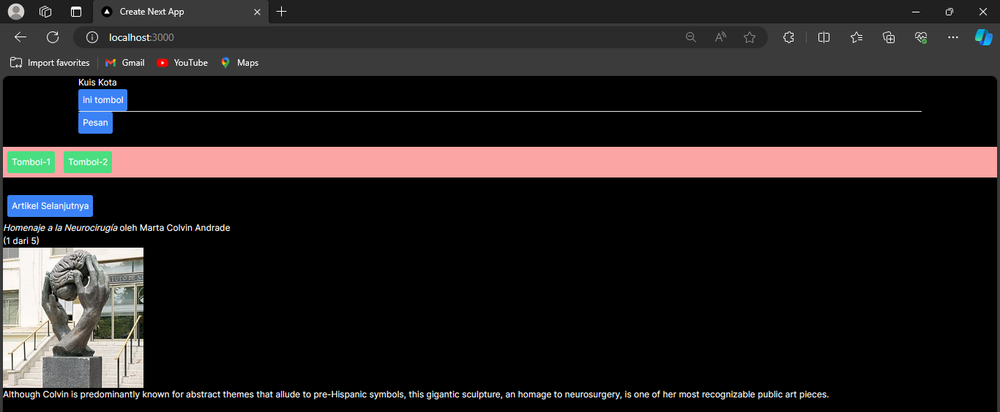 
Ya, tidak terjadi apa-apa 😀

## Langkah 2 - Menambahkan variabel state
Untuk menambahkan variabel state, impor useState dari React di paling atas file `src/components/gallery.tsx`
```
import { useState } from 'react';
```
Lalu, ubah baris berikut:
```
let index = 0;
```
menjadi
```
const [index, setIndex] = useState(0); 
```
index merupakan variabel state dan setIndex adalah fungsi setter.

Ubah fungsi dalam handleClick menjadi seperti ini
```
function handleClick() {
setIndex(index + 1); // counter index + 1, utk melihat data selanjutnya
}
```
Maka kode pada `gallery.tsx` seperti berikut
```
import { useState } from 'react';
import { sculptureList } from '../data/article'; // ambil data yang sudah ada

export default function Gallery() {
    const [index, setIndex] = useState(0);

    function handleClick() {
        setIndex(index + 1); // counter index + 1, utk melihat data selanjutnya
    }
    let sculpture = sculptureList[index]; // membaca data sesuai dengan index
    return (
        <>
            <button
                onClick={handleClick}
                className="bg-blue-500 hover:bg-blue-700 p-2 m-2 rounded"> Artikel Selanjutnya </button>

            <h2><i>{sculpture.name} </i> oleh {sculpture.artist} </h2>
            <h3>({index + 1} dari {sculptureList.length}) </h3>
            
            <p>
                {sculpture.description}
            </p>
        </>
    );
}
```
Jalankan pada browser dan amati apa yang terjadi.
### Output Praktikum 4 Langkah 2
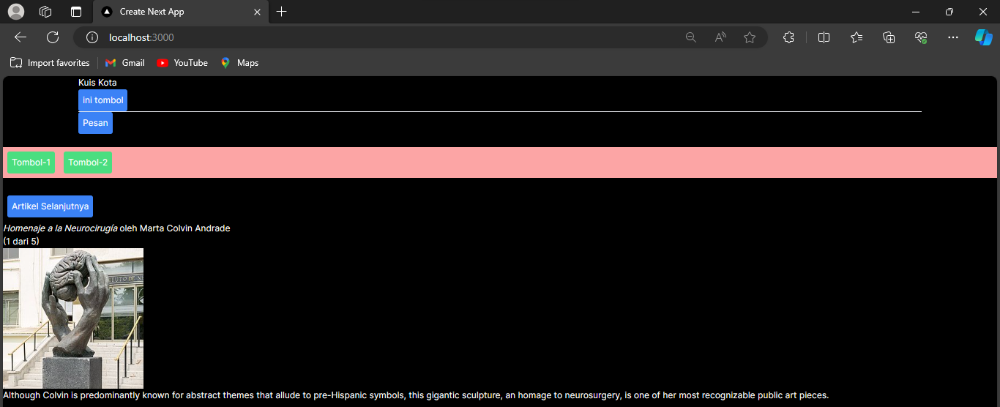 
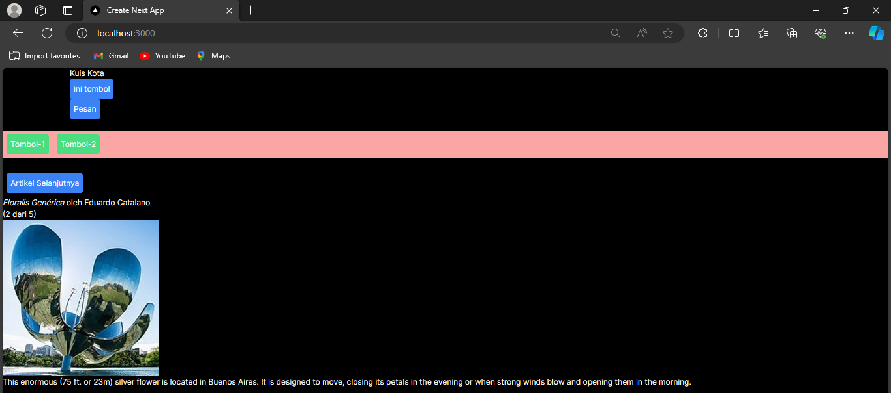 
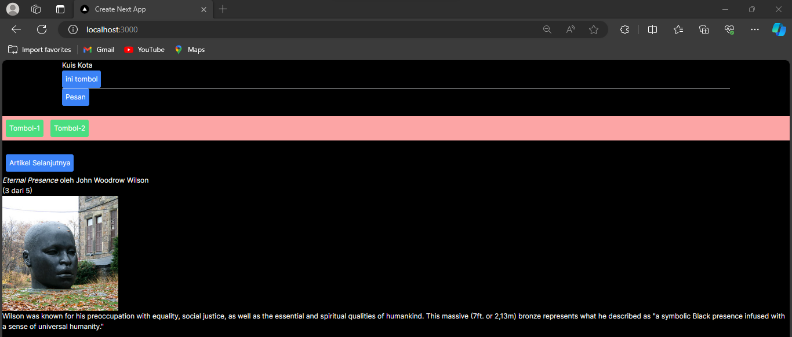 
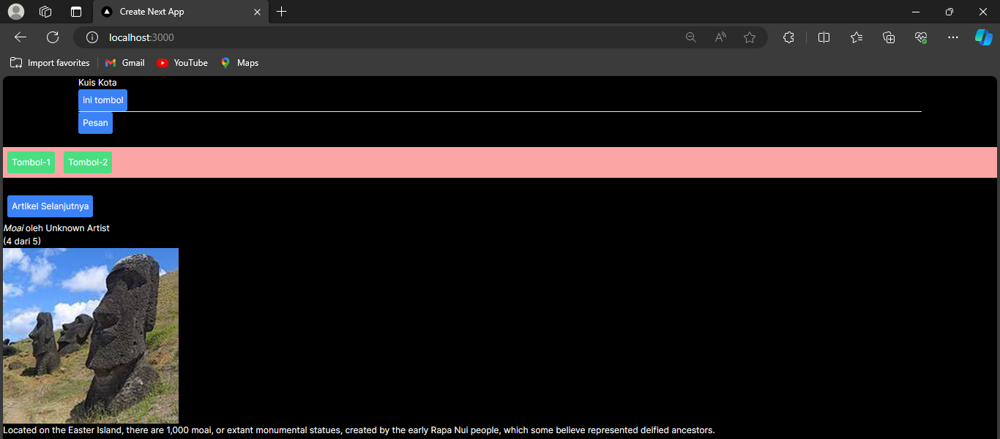 
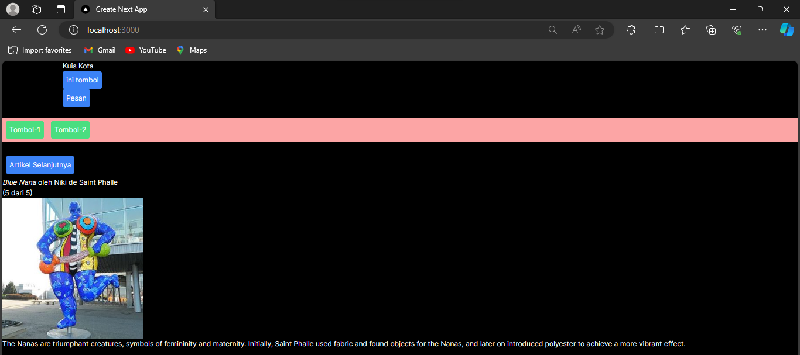 
Yang terjadi yaitu tombol bisa dipencet dan menuju slide article selanjutnya.