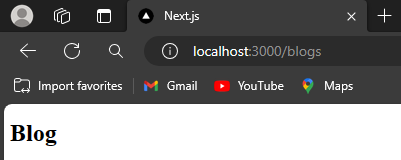
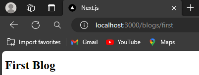
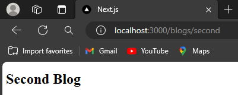
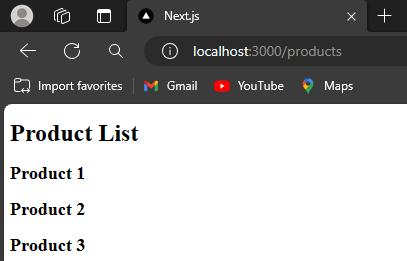
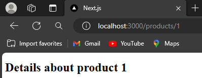
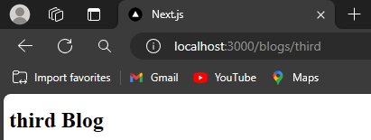
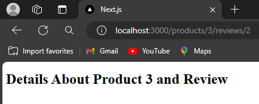

Nama    : Jenio Dwi Setyo Favian Gian

NIM     : 2141720212


# Praktikum 1: Membuat routing sederhana
Pada praktikum ini, Anda akan membuat 3 halaman yang di-handle oleh router, yaitu halaman `home`,, halaman `about`, dan halaman `profile`. Silakan lakukan langkah-langkah praktikum berikut ini.
## Langkah 1: Menambah file page.tsx di folder app
```
export default function Home() {
    return <h1>Welcome to Home</h1> ;
}
```
### Output Praktikum 1 Langkah 1
 
## Langkah 2: Menambah file page.tsx di folder app/about
```
export default function About() {
    return <h1>Welcome to About</h1> ;
  }
```
### Output Praktikum 1 Langkah 2
 

## Langkah 3: Menambah file page.tsx di folder /profile yang menampilkan isi biodata anda
```
export default function Profile() {
    return (
        <div>
            <h1>Biodata</h1>
            <table>
                <tbody>
                    <tr>
                        <td>Nama</td>
                        <td>:</td>
                        <td>Jenio Dwi Setyo Favian Gian</td>
                    </tr>
                    <tr>
                        <td>NIM</td>
                        <td>:</td>
                        <td>2141720212</td>
                    </tr>
                    <tr>
                        <td>Kelas</td>
                        <td>:</td>
                        <td>TI - 3C</td>
                    </tr>
                </tbody>
            </table>
        </div>
    )
}
```
### Output Praktikum 1 Langkah 3
 

# Praktikum 2: Membuat routing bersarang (Nested Routing)
## Langkah 1: Menambah file page.tsx di folder app/blogs, app/blogs/first dan app/blogs/second
blogs
```
export default function Blog() {
    return (
        <h1>Blog</h1>
    );
}
```
 
blogs/first
```
export default function FirstBlog() {
    return (
        <h1>First Blog</h1>
    );
}
```
 
blogs/second
```
export default function SecondBlog() {
    return (
        <h1>Second Blog</h1>
    );
}
```
 
# Praktikum 3: Membuat routing dinamis (Dynamic Routing)
## Langkah 1: Menambah file page.tsx di folder app/products
```
export default function ProductList() {
  return (
        <div>
          <h1>Product List</h1>
          <h2>Product 1</h2>
          <h2>Product 2</h2>
          <h2>Product 3</h2>
        </div>
  );
}
```
 
## Langkah 2: Menambah file page.tsx di folder app/products/[productId]
```
type Props = {
    params: {
          productId: string
    }
  }
  
  export default function ProductDetails({ params }: Props) {
    return (
          <h1>Details about product {params.productId}</h1>
    )
  }
  ```
   
## Langkah 3: Memperbaiki implementasi Praktikum 2 menggunakan Dynamic Routes
```
type Props = {
    params: {
          blogId: string
    }
  }
  
  export default function BlogDetails({ params }: Props) {
    return (
          <h1>{params.blogId} Blog</h1>
    )
  }
  
```
   
## Langkah 4: Membuat halaman dengan routing /products/[productId]/reviews/[reviewId]
```
type Props = {
    params: {
        productId: String,
        reviewId: String
    }
  }
  
  export default function ReviewDetails({ params }: Props) {
    return (
          <h1>Details About Product {params.productId} and Review {params.reviewId}</h1>
    )
  }
  
```
  