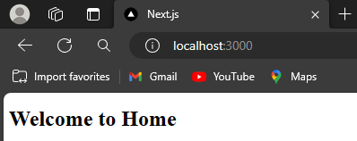
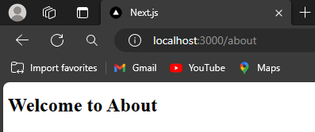
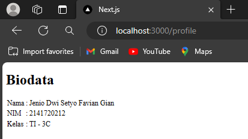

Nama    : Jenio Dwi Setyo Favian Gian

NIM     : 2141720212


# Praktikum 1: Membuat routing sederhana
Pada praktikum ini, Anda akan membuat 3 halaman yang di-handle oleh router, yaitu halaman `home`,, halaman `about`, dan halaman `profile`. Silakan lakukan langkah-langkah praktikum berikut ini.
## Langkah 1: Menambah file page.tsx di folder app
```
export default function Home() {
    return <h1>Welcome to Home</h1> ;
}
```
### Output Praktikum 1 Langkah 1
 
## Langkah 2: Menambah file page.tsx di folder app/about
```
export default function About() {
    return <h1>Welcome to About</h1> ;
  }
```
### Output Praktikum 1 Langkah 2
 

## Langkah 3: Menambah file page.tsx di folder /profile yang menampilkan isi biodata anda
```
export default function Profile() {
    return (
        <div>
            <h1>Biodata</h1>
            <table>
                <tbody>
                    <tr>
                        <td>Nama</td>
                        <td>:</td>
                        <td>Jenio Dwi Setyo Favian Gian</td>
                    </tr>
                    <tr>
                        <td>NIM</td>
                        <td>:</td>
                        <td>2141720212</td>
                    </tr>
                    <tr>
                        <td>Kelas</td>
                        <td>:</td>
                        <td>TI - 3C</td>
                    </tr>
                </tbody>
            </table>
        </div>
    )
}
```
### Output Praktikum 1 Langkah 3
 